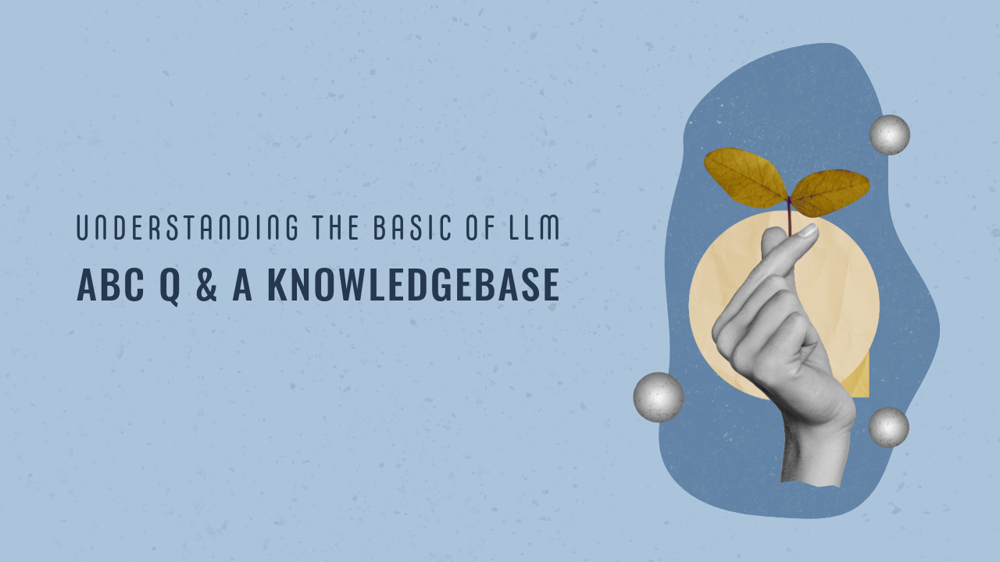

# ABC Q&A: Question and Answer System Based on Google Palm LLM and Langchain for  company  

This is an end to end LLM project based on Google Palm and Langchain. We are building a Q&A system for an e-learning company called ABC. ABC sells data related courses and bootcamps. They have thousands of learners who uses discord server or email to ask questions. This system will provide a streamlit based user interface for students where they can ask questions and get answers. 



## Project Highlights

- Use a real CSV file of FAQs that ABC company is using right now. 
- Their human staff will use this file to assist their course learners.
- We will build an LLM based question and answer system that can reduce the workload of their human staff.
- Students should be able to use this system to ask questions directly and get answers within seconds

## You will learn following,
  - Langchain + Google Palm: LLM based Q&A
  - Streamlit: UI
  - Huggingface instructor embeddings: Text embeddings
  - FAISS: Vector databse

## Installation

1.

```bash
  pip install -r requirements.txt
```
4.Acquire an api key through makersuite.google.com and put it in .env file

```bash
  GOOGLE_API_KEY="your_api_key_here"
```
## Usage

1. Run the Streamlit app by executing:
```bash
streamlit run main.py

```

2.The web app will open in your browser.

- To create a knowledebase of FAQs, click on Create Knolwedge Base button. It will take some time before knowledgebase is created so please wait.

- Once knowledge base is created you will see a directory called faiss_index in your current folder

- Now you are ready to ask questions. Type your question in Question box and hit Enter

## Sample Questions
  - What are training course available?
  - I don't see power pivot. how can I enable it?

## Project Structure

- main.py: The main Streamlit application script.
- langchain_helper.py: This has all the langchain code
- requirements.txt: A list of required Python packages for the project.
- .env: Configuration file for storing your Google API key.
